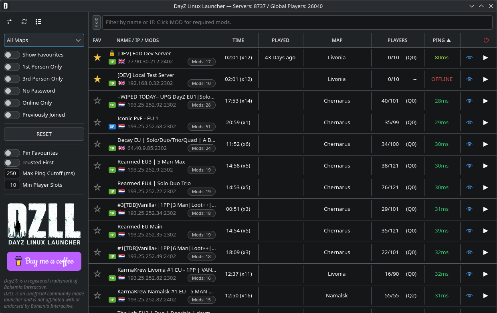

# 🧠 DZLL (DayZ Linux Launcher) — Python Version

A native Linux launcher for DayZ with Steam Client Workshop mod handling. SteamCMD is available as an advanced fallback.

🌐 Website: https://dzllauncher.uk/



---

## 📦 Requirements

- Linux (Fedora / Ubuntu / Arch / openSUSE)
- Python 3.10 or newer
- Native Steam (with DayZ installed)
- Flatpak Steam is unsupported — use native Steam
- DayZ must have been launched at least once to create the files DZLL needs
- Steam Client Workshop backend is the default/recommended mod handler
- SteamCMD is optional and only needed for Advanced SteamCMD Fallback troubleshooting

---

## 🚀 Full Install Guide (Step-by-Step)

**Follow everything in order — do not skip steps.**

---

## 🧩 1. Install system packages

These install GTK + Python bindings (required for the UI).

### 🟥 Fedora / Nobara / Bazzite

```bash
sudo dnf install python3 python3-pip python3-gobject gtk4
```

### 🟧 Ubuntu / Debian / Mint / Pop!_OS

```bash
sudo apt update
sudo apt install python3 python3-pip python3-venv python3-gi python3-gi-cairo gir1.2-gtk-4.0
```

### 🟦 Arch / EndeavourOS / CachyOS

```bash
sudo pacman -Syu
sudo pacman -S python python-pip python-gobject gtk4
```

### 🟩 openSUSE

```bash
sudo zypper refresh
sudo zypper install python3 python3-pip python3-gobject python3-gobject-Gdk typelib-1_0-Gtk-4_0 libgtk-4-1
```

---

## 📁 2. Extract DZLL

```bash
mkdir -p ~/DayZLinuxLauncher
cd ~/DayZLinuxLauncher

# Replace with your actual file path
tar -xzf ~/Downloads/dzll-launcher-v0.3.1-beta.tar.gz

cd dzll-launcher-v0.3.1-beta
```

---

## 🐍 3. Create Python virtual environment

⚠️ **IMPORTANT:** we use `--system-site-packages` so GTK works properly

```bash
python3 -m venv --system-site-packages .venv
source .venv/bin/activate
```

---

## 📦 4. Install Python dependencies

```bash
python -m pip install --upgrade pip setuptools wheel
python -m pip install -r requirements.txt
```

---

## 📦 5. Install DZLL (editable mode)

This makes the package runnable correctly.

```bash
python -m pip install -e .
```

---

## 🧪 6. Verify everything works

```bash
python - <<'PY'
import gi
gi.require_version("Gtk", "4.0")
from gi.repository import Gtk
import requests
print("✅ Required dependencies OK")
PY
```

`pypresence` does not need to be installed separately for normal use. DZLL includes a bundled Rich Presence fallback. To test an external/system `pypresence` provider instead, install the optional `discord-system` extra or uncomment the optional line in `requirements.txt`.

If you see `✅ Required dependencies OK`, continue.

---

## 🎮 7. Install Steam (if not already installed)

### Fedora

```bash
sudo dnf install steam
```

*(May require RPM Fusion enabled)*

### Ubuntu / Debian

```bash
sudo apt install steam-installer
```

### Arch

```bash
sudo pacman -S steam
```

### openSUSE

```bash
sudo zypper install steam
```

Launch Steam once and install **DayZ**, then launch DayZ at least once before continuing.

---

## ⚙️ 8. Optional: Install SteamCMD fallback

Most users should skip this section. DZLL uses the native Steam Client Workshop backend by default.

Install SteamCMD only if you need the Advanced SteamCMD Fallback for troubleshooting.

If you do need it, make sure `wget` is installed:

```bash
sudo apt install wget      # Ubuntu/Debian
sudo dnf install wget      # Fedora
sudo pacman -S wget        # Arch
sudo zypper install wget   # openSUSE
```

### Install SteamCMD fallback

```bash
mkdir -p ~/.local/share/steamcmd
cd ~/.local/share/steamcmd

wget https://steamcdn-a.akamaihd.net/client/installer/steamcmd_linux.tar.gz
tar -xzf steamcmd_linux.tar.gz
chmod +x steamcmd.sh
```

Use the path above if possible so DZLL can auto-detect the fallback.

### Test it

```bash
~/.local/share/steamcmd/steamcmd.sh +quit
```

If it prints SteamCMD info and exits without errors, the fallback is available.

---

### 🧠 Important Notes

- This installs SteamCMD locally for the advanced fallback
- DZLL will auto-detect this fallback path:

```bash
~/.local/share/steamcmd/steamcmd.sh
```

- You do **NOT** need to manually enter it unless detection fails
- Normal Steam Client backend users should not need SteamCMD credentials

**IMPORTANT:**  
DZLL does **not** store your Steam password at all.

---

## 🚀 9. Launch DZLL

```bash
source .venv/bin/activate
python -m dzll_launcher
```

---

## ⚙️ First Launch Setup (IMPORTANT)

When DZLL opens:

- Do **NOT** change settings yet
- Just try joining a server first

DZLL should:

- use native Steam to check and download required Workshop mods
- auto-detect the DayZ Steam library and Workshop paths
- launch DayZ

---

## 🧠 How DZLL Works

When you click **Join**:

1. Reads server mod list
2. Uses the Steam Client Workshop backend to check and download required mods
3. Creates symlinks into DayZ Launcher watch folder
4. Updates preset (`dayz.defaultpreset2`)
5. Launches DayZ via Steam

---

## 🧪 Troubleshooting

### ❌ Mods not loading / kicked from server

Likely causes:

- broken mod (DZLL should auto-fix)
- Steam not running or not logged in
- Workshop path wrong

Try:

- leave settings blank (use autodetect)
- make sure native Steam is running and logged in
- rejoin server

---

### ❌ Advanced SteamCMD fallback not found

Only use this if you enabled Advanced SteamCMD Fallback in Settings.

```bash
ls ~/.local/share/steamcmd/steamcmd.sh
```

If missing, reinstall SteamCMD fallback.

---

### ❌ GTK / gi import errors

You likely missed system packages.

Reinstall your distro section above.

---

### ❌ Python version too old

```bash
python3 --version
```

Must be **3.10+**

---

### ❌ Steam launches but does not join server

Make sure DayZ has been launched at least once from Steam.

This creates required launcher files DZLL depends on.

---

## 🧼 Resetting DZLL safely

DZLL Reset button:

- resets settings only ✅
- does **NOT** delete mods / SteamCMD / files ❌

To fully wipe DZLL state manually:

```bash
rm -rf ~/.config/dzll ~/.cache/dzll ~/.local/share/dzll
```

---

## 🧠 Recommended Project Layout

```text
dzll-launcher-v0.3.1-beta/
├── src/dzll_launcher/
├── pyproject.toml
├── README.md
├── requirements.txt
└── .venv/
```

---

## 💬 Final Notes

- Leave SteamCMD fallback settings empty unless troubleshooting
- Autodetect is preferred and safer
- Reset is non-destructive and safe to use

---

## Community / Support

Join the DZLL Discord for help, feedback, testing, and community discussion: https://discord.gg/vhd6SbvAqS

## Licence

DZLL is free, source-available community software under the DZLL Community
Source Licence v1.0.

The source is public for inspection, auditing, and community improvement. DZLL
may not be sold, paywalled, monetised, bundled into paid services, or used for
paid server promotion, paid placement, advertising, affiliate schemes, or
referral schemes.

Modified versions must remain free, include the licence, keep attribution, and
clearly state that they are unofficial. See [LICENSE](LICENSE) for the full
terms.

### Third-Party Components

DZLL includes a modified vendored snapshot of
[python-a2s](https://github.com/Yepoleb/python-a2s), which is licensed under the
MIT License. Its licence and notice are included at
[`src/dzll_launcher/a2s/LICENSE`](src/dzll_launcher/a2s/LICENSE) and
[`src/dzll_launcher/a2s/NOTICE`](src/dzll_launcher/a2s/NOTICE). python-a2s is
not covered by the DZLL Community Source Licence.

DZLL also includes an unmodified vendored snapshot of
[pypresence 4.6.1](https://github.com/qwertyquerty/pypresence/tree/v4.6.1),
which is licensed under the MIT License. Its licence and notice are included at
[`src/dzll_launcher/vendor/pypresence/LICENSE`](src/dzll_launcher/vendor/pypresence/LICENSE)
and
[`src/dzll_launcher/vendor/pypresence/NOTICE`](src/dzll_launcher/vendor/pypresence/NOTICE).
pypresence is not covered by the DZLL Community Source Licence.

## Disclaimer

DZLL is an independent community project and is not affiliated with, endorsed
by, sponsored by, or authorized by Bohemia Interactive a.s.

Bohemia Interactive, DAYZ, and all associated logos and designs are trademarks
or registered trademarks of Bohemia Interactive a.s. All other trademarks are
the property of their respective owners.
